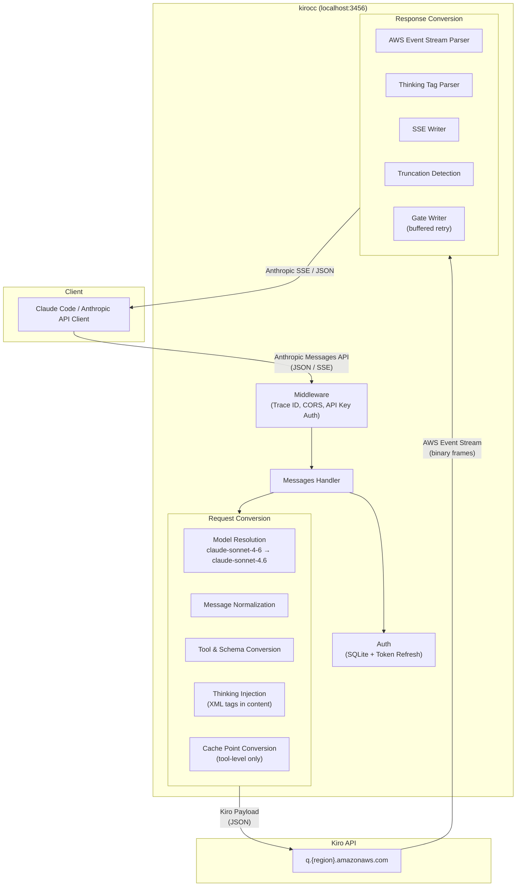

# kirocc

A local proxy server that relays Anthropic Messages API-compatible requests to the Kiro (Amazon Q) backend using Kiro CLI credentials.

Just set `ANTHROPIC_BASE_URL` from any Anthropic API client (e.g., Claude Code) to use Claude models via Kiro.

## Features

- **Anthropic Messages API compatible** — Supports `/v1/messages` (streaming / non-streaming), `/v1/messages/count_tokens`, and `/v1/models`
- **Request conversion** — Automatically converts Anthropic API requests to Kiro API (AWS Event Stream) format
- **Response conversion** — Converts Kiro event streams back to Anthropic SSE format
- **Automatic auth management** — Reads credentials from Kiro CLI's SQLite DB with automatic token refresh (Social / OIDC)
- **Model mapping** — Maps Anthropic model names (e.g., `claude-sonnet-4-6`) to Kiro model names. Customizable via environment variable
- **Extended Thinking** — Supports `[1m]` suffix, `thinking` field, and `reasoning_effort` / `budget_tokens` for extended thinking mode
- **Prompt Caching** — Converts Anthropic tool-level `cache_control` to Kiro `cachePoint`
- **Truncation detection** — Automatically injects a notice into the next request when a response is truncated
- **Retry** — Exponential backoff retry for 403 (token expiry), 429, and 5xx errors. Also retries thinking-only (empty visible) responses
- **API key auth** — Optional access restriction for the proxy itself
- **CORS** — Allows requests from localhost origins

## Prerequisites

- Go 1.26+
- [Kiro CLI](https://kiro.dev) installed and logged in

## Installation

### Homebrew

```bash
brew install d-kuro/tap/kirocc
```

### go install

```bash
go install github.com/d-kuro/kirocc/cmd/kirocc@latest
```

## Usage

### Start the server

```bash
kirocc
```

Listens on `http://127.0.0.1:3456` by default.

### Use with Claude Code

```bash
export ANTHROPIC_BASE_URL=http://127.0.0.1:3456
export ANTHROPIC_AUTH_TOKEN=dummy
claude
```

`ANTHROPIC_AUTH_TOKEN` is required by Claude Code but not used for authentication by kirocc (credentials are read from Kiro CLI's DB). Any non-empty value works unless `-api-key` is set.

### Command-line options

| Flag       | Default                   | Description                          |
| ---------- | ------------------------- | ------------------------------------ |
| `-port`    | `3456`                    | Listen port                          |
| `-host`    | `127.0.0.1`               | Bind host                            |
| `-db`      | (OS-dependent, see below) | Kiro CLI SQLite DB path              |
| `-api-key` | (none)                    | API key required to access the proxy |
| `-debug`   | `false`                   | Enable debug logging                 |

#### Default DB path

| OS    | Path                                                  |
| ----- | ----------------------------------------------------- |
| macOS | `~/Library/Application Support/kiro-cli/data.sqlite3` |
| Linux | `~/.local/share/kiro-cli/data.sqlite3`                |

### Environment variables

Command-line options can be overridden with environment variables.

| Variable         | Corresponding option |
| ---------------- | -------------------- |
| `KIROCC_PORT`    | `-port`              |
| `KIROCC_HOST`    | `-host`              |
| `KIROCC_DB_PATH` | `-db`                |
| `KIROCC_API_KEY` | `-api-key`           |
| `KIROCC_DEBUG`   | `-debug`             |

### Custom model mappings

Use the `KIROCC_MODEL_MAPPINGS` environment variable to override model name mappings.

```bash
export KIROCC_MODEL_MAPPINGS='[{"anthropic":"my-model","kiro":"claude-sonnet-4.5","context_window_size":200000}]'
```

## Endpoints

| Path                             | Description                              |
| -------------------------------- | ---------------------------------------- |
| `GET /health`                    | Health check                             |
| `GET /v1/models`                 | List available models                    |
| `POST /v1/messages`              | Messages API (streaming / non-streaming) |
| `POST /v1/messages/count_tokens` | Token count (approximate \*)             |

\* `count_tokens` uses the `cl100k_base` encoding from [tiktoken-go](https://github.com/pkoukk/tiktoken-go), which differs from Claude's actual tokenizer. The returned value is an approximation.

## Architecture



### Request flow

1. Client sends an Anthropic Messages API request to kirocc
2. Middleware assigns a trace ID, handles CORS, and validates the API key
3. Auth reads/refreshes credentials from Kiro CLI's SQLite DB
4. Handler resolves the model name and determines thinking mode
5. Request conversion pipeline:
   - Normalizes messages (merges consecutive same-role messages, extracts text/images/tool_use/tool_result from multi-block content)
   - Converts tools and sanitizes JSON Schema (removes unsupported keywords, flattens `anyOf`/`oneOf`/`allOf`)
   - Extracts system prompt and places it as a history entry pair
   - Reorders tool results to match the preceding assistant's tool_use order
   - Injects thinking mode as XML tags (`<thinking_mode>`, `<max_thinking_length>`) into message content
   - Converts Anthropic tool-level `cache_control` to Kiro `cachePoint`
6. Kiro API returns an AWS Event Stream (binary frames)
7. Response conversion pipeline:
   - Parses binary event stream frames
   - Converts cumulative text to incremental deltas
   - Parses `<thinking>` tags from `assistantResponseEvent` or uses `reasoningContentEvent` (with deduplication)
   - Enforces `stop_sequences` and `max_tokens` adapter-side
   - Detects truncated responses and stores them; a notice is injected into the next request
   - Gate Writer buffers output until visible content arrives, enabling transparent retry of thinking-only responses

### Extended Thinking

The Kiro API does not have a dedicated field for thinking configuration. kirocc injects thinking parameters as XML tags into the message content:

```
<thinking_mode>enabled</thinking_mode>
<max_thinking_length>{budget_tokens}</max_thinking_length>

{user message}
```

Thinking is enabled by any of:

- Model name with `[1m]` suffix (e.g., `claude-sonnet-4-6[1m]`)
- `Anthropic-Beta` header containing `context-1m` (e.g., `context-1m-2025-01-01`)
- `thinking.type` set to `"enabled"` or `"adaptive"` in the request

The thinking budget is determined by:

1. `thinking.budget_tokens` if explicitly set
2. Derived from `thinking.reasoning_effort`: `high` = 31999, `medium` = 10000, `low` = 4000
3. Default: 10000 (medium)

### Model mappings

| Input model             | Kiro model             |
| ----------------------- | ---------------------- |
| `claude-sonnet-4-6`     | `claude-sonnet-4.6`    |
| `claude-sonnet-4-6[1m]` | `claude-sonnet-4.6-1m` |
| `claude-sonnet-4.5`     | `claude-sonnet-4.5`    |
| `claude-sonnet-4.5[1m]` | `claude-sonnet-4.5-1m` |
| `claude-opus-4-6`       | `claude-opus-4.6`      |
| `claude-opus-4-6[1m]`   | `claude-opus-4.6-1m`   |
| `claude-opus-4.5`       | `claude-opus-4.5`      |
| `claude-haiku-4.5`      | `claude-haiku-4.5`     |

Unmatched `claude-*` models are passed through as-is. Non-claude models fall back to `claude-sonnet-4.6`.

## License

Apache License 2.0
