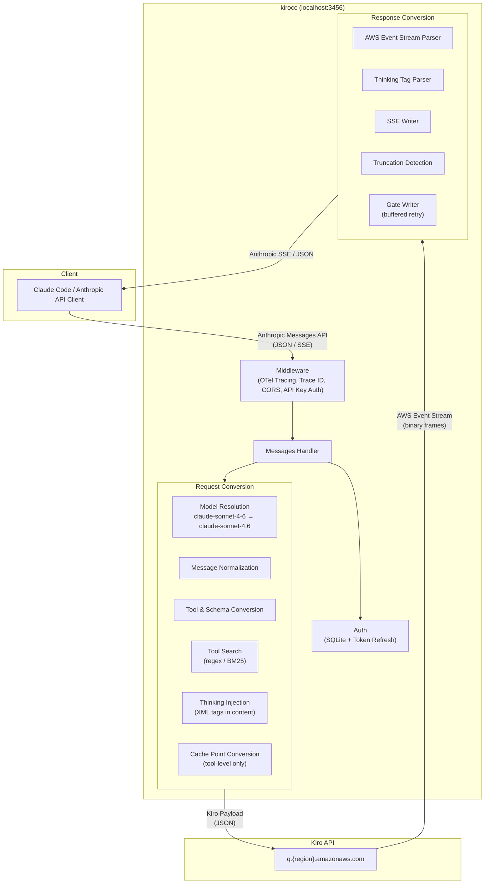

# kirocc

A local proxy server that relays Anthropic Messages API-compatible requests to the Kiro (Amazon Q) backend using Kiro CLI credentials.

Just set `ANTHROPIC_BASE_URL` from any Anthropic API client (e.g., Claude Code) to use Claude models via Kiro.

## Features

- **Anthropic Messages API compatible** — Supports `/v1/messages` (streaming / non-streaming), `/v1/messages/count_tokens`, and `/v1/models`
- **Request conversion** — Automatically converts Anthropic API requests to Kiro API (AWS Event Stream) format
- **Response conversion** — Converts Kiro event streams back to Anthropic SSE format
- **Automatic auth management** — Reads credentials from Kiro CLI's SQLite DB with automatic token refresh (Social / OIDC)
- **Model mapping** — Maps Anthropic model names (e.g., `claude-sonnet-4-6`) to Kiro model names. Customizable via environment variable
- **Extended Thinking** — Supports `[1m]` suffix, `thinking` field, `output_config.effort`, and `budget_tokens` for extended thinking mode
- **Tool Search** — Proxy-side implementation of Anthropic's [Tool Search Tool](https://platform.claude.com/docs/en/agents-and-tools/tool-use/tool-search-tool). Supports `tool_search_tool_regex_20251119` and `tool_search_tool_bm25_20251119` with `defer_loading` for on-demand tool discovery
- **Prompt Caching** — Converts Anthropic tool-level `cache_control` to Kiro `cachePoint`
- **Truncation detection** — Automatically injects a notice into the next request when a response is truncated
- **Retry** — Exponential backoff retry for 403 (token expiry), 429, and 5xx errors. Also retries thinking-only (empty visible) responses
- **API key auth** — Optional access restriction for the proxy itself
- **CORS** — Allows requests from localhost origins
- **File logging** — Write structured logs (OTel JSON Lines) to a rotating file via [lumberjack](https://github.com/natefinch/lumberjack). Defaults optimized for coding agent consumption (10 MB, uncompressed)
- **OpenTelemetry tracing** — Opt-in distributed tracing via `--otel` with OTLP HTTP exporter. Captures request/response headers and body as span events across the full proxy chain

## Prerequisites

- Go 1.26+
- [Kiro CLI](https://kiro.dev) installed and logged in

## Installation

### Homebrew

```bash
brew install d-kuro/tap/kirocc
```

### go install

```bash
go install github.com/d-kuro/kirocc/cmd/kirocc@latest
```

## Usage

### Start the server

```bash
kirocc
```

Listens on `http://127.0.0.1:3456` by default.

### Use with Claude Code

```bash
export ANTHROPIC_BASE_URL=http://127.0.0.1:3456
export ANTHROPIC_AUTH_TOKEN=dummy
claude
```

`ANTHROPIC_AUTH_TOKEN` is required by Claude Code but not used for authentication by kirocc (credentials are read from Kiro CLI's DB). Any non-empty value works unless `-api-key` is set.

### Command-line options

| Flag               | Default                   | Description                                                        |
| ------------------ | ------------------------- | ------------------------------------------------------------------ |
| `-port`            | `3456`                    | Listen port                                                        |
| `-host`            | `127.0.0.1`               | Bind host                                                          |
| `-db`              | (OS-dependent, see below) | Kiro CLI SQLite DB path                                            |
| `-api-key`         | (none)                    | API key required to access the proxy                               |
| `-debug`           | `false`                   | Enable debug logging                                               |
| `-log-file`        | (none)                    | Write logs to file with rotation (file-only by default)            |
| `-log-max-size`    | `10`                      | Max log file size in MB before rotation                            |
| `-log-max-backups` | `5`                       | Max number of old log files to retain                              |
| `-log-max-age`     | `7`                       | Max days to retain old log files                                   |
| `-log-compress`    | `false`                   | Compress rotated log files with gzip                               |
| `-log-console`     | `false`                   | Also write logs to console when `-log-file` is set                 |
| `-otel`            | `false`                   | Enable OpenTelemetry tracing (OTLP HTTP exporter)                  |
| `-otel-body-limit` | `32768`                   | Max bytes of request body to capture in OTel spans (0 = unlimited) |

#### Default DB path

| OS    | Path                                                  |
| ----- | ----------------------------------------------------- |
| macOS | `~/Library/Application Support/kiro-cli/data.sqlite3` |
| Linux | `~/.local/share/kiro-cli/data.sqlite3`                |

### Environment variables

Command-line options can be overridden with environment variables.

| Variable                 | Corresponding option |
| ------------------------ | -------------------- |
| `KIROCC_PORT`            | `-port`              |
| `KIROCC_HOST`            | `-host`              |
| `KIROCC_DB_PATH`         | `-db`                |
| `KIROCC_API_KEY`         | `-api-key`           |
| `KIROCC_DEBUG`           | `-debug`             |
| `KIROCC_LOG_FILE`        | `-log-file`          |
| `KIROCC_LOG_MAX_SIZE`    | `-log-max-size`      |
| `KIROCC_LOG_MAX_BACKUPS` | `-log-max-backups`   |
| `KIROCC_LOG_MAX_AGE`     | `-log-max-age`       |
| `KIROCC_LOG_COMPRESS`    | `-log-compress`      |
| `KIROCC_LOG_CONSOLE`     | `-log-console`       |
| `KIROCC_OTEL`            | `-otel`              |
| `KIROCC_OTEL_BODY_LIMIT` | `-otel-body-limit`   |

### OpenTelemetry tracing

Enable distributed tracing to visualize the full request chain in Jaeger, Grafana Tempo, or any OTLP-compatible backend.

```bash
# Start a local collector (e.g., Grafana LGTM stack)
docker run -d --name lgtm -p 3000:3000 -p 4317:4317 -p 4318:4318 grafana/otel-lgtm

# Start kirocc with tracing enabled
kirocc -otel
```

The OTLP endpoint defaults to `http://localhost:4318` and can be configured via the standard `OTEL_EXPORTER_OTLP_ENDPOINT` environment variable.

### Custom model mappings

Use the `KIROCC_MODEL_MAPPINGS` environment variable to override model name mappings.

```bash
export KIROCC_MODEL_MAPPINGS='[{"anthropic":"my-model","kiro":"claude-sonnet-4.5","context_window_size":200000}]'
```

## Endpoints

| Path                             | Description                              |
| -------------------------------- | ---------------------------------------- |
| `GET /health`                    | Health check                             |
| `GET /v1/models`                 | List available models                    |
| `POST /v1/messages`              | Messages API (streaming / non-streaming) |
| `POST /v1/messages/count_tokens` | Token count (approximate \*)             |

\* `count_tokens` uses the `cl100k_base` encoding from [tiktoken-go](https://github.com/pkoukk/tiktoken-go), which differs from Claude's actual tokenizer. The returned value is an approximation.

## Architecture



### Request flow

1. Client sends an Anthropic Messages API request to kirocc
2. Middleware assigns a trace ID, handles CORS, and validates the API key
3. Auth reads/refreshes credentials from Kiro CLI's SQLite DB
4. Handler resolves the model name and determines thinking mode
5. Request conversion pipeline:
   - Normalizes messages (merges consecutive same-role messages, extracts text/images/tool_use/tool_result from multi-block content)
   - Converts tools and sanitizes JSON Schema (removes unsupported keywords, flattens `anyOf`/`oneOf`/`allOf`)
   - If tool search tools are present, partitions tools into active/deferred and injects a proxy-side `ToolSearch` tool
   - Extracts system prompt and places it as a history entry pair
   - Reorders tool results to match the preceding assistant's tool_use order
   - Injects thinking mode as XML tags (`<thinking_mode>`, `<max_thinking_length>`) into message content
   - Converts Anthropic tool-level `cache_control` to Kiro `cachePoint`
6. Kiro API returns an AWS Event Stream (binary frames)
7. Response conversion pipeline:
   - Parses binary event stream frames
   - Converts cumulative text to incremental deltas
   - Intercepts `ToolSearch` tool_use calls, executes search, emits `server_tool_use`/`tool_search_tool_result` SSE events, and re-requests Kiro with discovered tools (up to 3 rounds)
   - Parses `<thinking>` tags from `assistantResponseEvent` or uses `reasoningContentEvent` (with deduplication)
   - Enforces `stop_sequences` and `max_tokens` adapter-side
   - Detects truncated responses and stores them; a notice is injected into the next request
   - Gate Writer buffers output until visible content arrives, enabling transparent retry of thinking-only responses

### Extended Thinking

The Kiro API does not have a dedicated field for thinking configuration. kirocc injects thinking parameters as XML tags into the message content:

```
<thinking_mode>enabled</thinking_mode>
<max_thinking_length>{budget_tokens}</max_thinking_length>

{user message}
```

Thinking is enabled by any of:

- Model name with `[1m]` suffix (e.g., `claude-sonnet-4-6[1m]`)
- `Anthropic-Beta` header containing `context-1m` (e.g., `context-1m-2025-01-01`)
- `thinking.type` set to `"enabled"` or `"adaptive"` in the request

The thinking budget is determined by:

1. `thinking.budget_tokens` if explicitly set
2. Derived from `output_config.effort`: `max` = 160000, `xhigh` = 80000, `high` = 40000, `medium` = 10000, `low` = 4000
3. Default: 10000 (medium)

### Tool Search

The Kiro backend does not support Anthropic's [Tool Search Tool](https://platform.claude.com/docs/en/agents-and-tools/tool-use/tool-search-tool). kirocc implements it proxy-side with an inner loop:

1. Client sends `tool_search_tool_regex_20251119` (or `bm25`) + tools with `defer_loading: true`
2. Proxy partitions tools into active (sent to Kiro) and deferred (held for search)
3. Proxy injects a `ToolSearch` tool definition that Kiro can understand
4. When the model calls `ToolSearch`, the proxy intercepts the tool_use:
   - Executes regex or BM25 search against deferred tools
   - Emits `server_tool_use` + `tool_search_tool_result` SSE events to the client
   - Promotes discovered tools to active and rebuilds the Kiro request
   - Calls Kiro again with the updated tool list (up to 3 rounds)
5. When the model calls a regular tool or produces text, the response is forwarded to the client

Supported query forms:

- `select:Read,Edit,Grep` — exact tool selection by name
- `read file` — keyword search (regex with word-level OR fallback, or BM25 scoring)

### Model mappings

| Input model             | Kiro model             | Context window |
| ----------------------- | ---------------------- | -------------- |
| `claude-sonnet-4-6`     | `claude-sonnet-4.6`    | 200k           |
| `claude-sonnet-4-6[1m]` | `claude-sonnet-4.6-1m` | 1M             |
| `claude-sonnet-4.5`     | `claude-sonnet-4.5`    | 200k           |
| `claude-sonnet-4.5[1m]` | `claude-sonnet-4.5-1m` | 1M             |
| `claude-opus-4-8`       | `claude-opus-4.8`      | 1M             |
| `claude-opus-4-8[1m]`   | `claude-opus-4.8`      | 1M             |
| `claude-opus-4-7`       | `claude-opus-4.7`      | 1M             |
| `claude-opus-4-7[1m]`   | `claude-opus-4.7`      | 1M             |
| `claude-opus-4-6`       | `claude-opus-4.6`      | 1M             |
| `claude-opus-4-6[1m]`   | `claude-opus-4.6`      | 1M             |
| `claude-opus-4.5`       | `claude-opus-4.5`      | 200k           |
| `claude-haiku-4.5`      | `claude-haiku-4.5`     | 200k           |

Opus 4.6, 4.7, and 4.8 always use 1M context (no 200k SKU exists upstream). The explicit `[1m]`-suffixed aliases (`claude-opus-4-8[1m]` / `claude-opus-4-7[1m]` / `claude-opus-4-6[1m]`) are first-class entries that preserve the suffix verbatim in the response `model` field — this matches Claude Code's default Max-plan state (`lG()` emits `claude-opus-4-8[1m]`) and keeps its `mR()` 1M-context check happy without spuriously enabling extended thinking. Thinking is still opt-in via Sonnet `[1m]` suffix, `Anthropic-Beta: context-1m` header, or `thinking` field.

Unmatched `claude-*` models are passed through as-is. Non-claude models fall back to `claude-sonnet-4.6`.

#### Response model ID

The `model` field in `/v1/messages` responses (streaming `message_start`, non-streaming body, and tool-search path) is returned as the **Anthropic-form ID** (e.g. `claude-opus-4-7`), not the Kiro SKU (`claude-opus-4.7`).

When the proxy routes to a **1M context window** (always-1M SKU such as `claude-opus-4.8` / `claude-opus-4.7` / `claude-opus-4.6`, or a model invoked with the `[1m]` suffix or `Anthropic-Beta: context-1m` header), a trailing `[1m]` is appended to the response model ID (e.g. `claude-opus-4-8[1m]`). Claude Code's client-side context-window logic matches `/\[1m\]/i` on the response model to pick the 1M window — without the suffix it defaults to 200k and auto-compacts at ~160k even when upstream actually has 1M of context.

Note: `[1m]` has different meanings on request vs. response. On the **request** `model` it is a client-supplied thinking-opt-in signal (and is stripped before upstream routing). On the **response** `model` it is purely a context-window advertisement for Claude Code and does not imply that extended thinking was enabled.

## License

Apache License 2.0
